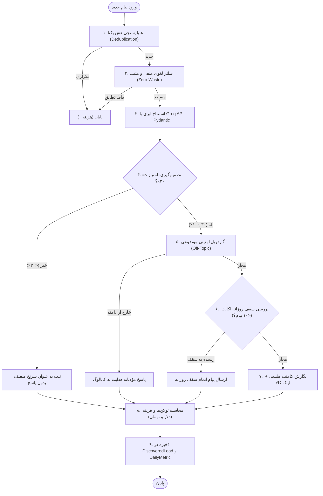

# سند جامع مهندسی ایجنت و پایپ‌لاین هوش مصنوعی (AI Agent & LLM Engineering Specification)
> **ویژه تیم دو نفره توسعه هوش مصنوعی در مسابقه buildX (مسئله شماره ۱: کاشف مشتری در جامعه آنلاین)**  
> **پروژه:** مشتری‌یاب (Moshtari-Yab) — پلتفرم معکوس کشف فرصت‌های فروش، رصد جوامع آنلاین و تعامل خودکار  
> **نسخه سند:** ۲.۰ (به‌روزرسانی جامع سهمیه‌های روزانه، دسترسی به بک‌اند، خزنده‌ها و گراف ایجنتیک)  

---

## ۱. بیانیه مسئله مسابقه buildX و خطوط قرمز داوری

در جریان مکالمات و پیام‌های شبکه‌های اجتماعی (توییتر/X، گروه‌ها و سوپرگروه‌های تلگرام، کامیونیتی‌های تخصصی)، صدها فرصت فروش به دلیل شلوغی و عدم پایش گم می‌شوند. هدف این پروژه ساخت یک **سیستم ایجنتیک کاشف مشتری** است که:
1. پیام‌های عمومی کاربران را رصد کند.
2. زمینه گفتگو، نیاز واقعی و سطح تخصص/درخواست فرد را بفهمد.
3. در میان کاتالوگ فروشنده، بهترین محصول متناسب را تطبیق دهد.
4. تصمیم بگیرد کدام پیام ارزش بررسی عمیق یا پاسخ دارد.
5. **هزینه بررسی هر پیام (توکن و تومان)** و **کیفیت فرصت‌های کشف‌شده** را به صورت شفاف محاسبه و ثبت نماید.
6. پاسخی طبیعی و متقاعدکننده همراه با **لینک مستقیم کارت کالا** ارسال کند.

### ⚠️ خطوط قرمز اکید مسابقه:
* **ابزارهای No-Code/Low-Code ممنوع است:** استفاده از پلتفرم‌های آماده مانند n8n، Zapier و Make اکیداً ممنوع بوده و صفر داوری در پی دارد. پیاده‌سازی باید کاملاً ایجنتیک بر پایه کد (Python, LangGraph, Pydantic) باشد.
* **اجرای مدل محلی (Local LLM) ممنوع است:** اجرای مدل روی لپ‌تاپ یا منابع محدود محلی مجاز نیست؛ حتماً باید از یک **ارائه‌دهنده ابری (Provider API)** مانند **Groq Cloud API** (با مدل فوق‌سریع `llama-3.3-70b-versatile` یا `llama-3.1-8b-instant`) یا OpenAI استفاده شود.
* **شفافیت هزینه بررسی و نمره کیفیت:** طبق متن صریح مسئله *«(همینطور هزینهٔ بررسی هر پیام و کیفیت فرصت‌های کشف‌شده را نشان دهید)»*، محاسبه تعداد توکن‌ها و هزینه دلاری/تومانی به ازای تک‌تک پیام‌ها الزامی است و در دیتابیس و پنل ذخیره و نمایش داده می‌شود.

---

## ۲. تفکیک دقیق وظایف تیم دو نفره هوش مصنوعی

برای پوشش کامل و بی‌نقص چالش‌ها، وظایف تیم هوش مصنوعی به دو نقش تخصصی و مکمل تفکیک شده است:

```
┌────────────────────────────────────────────────────────────────────────────────────────┐
│                              تیم توسعه هوش مصنوعی (AI Team)                              │
├───────────────────────────────────────────┬────────────────────────────────────────────┤
│   مهندس ۱: سیستم‌های ایجنتیک، جریان کار و رصد   │     مهندس ۲: مدل‌های زبانی، پرامپت و امنیت   │
│   (Agent Systems, Workflows & Listeners)  │   (LLMs, Prompts, Context & Guardrails)    │
├───────────────────────────────────────────┼────────────────────────────────────────────┤
│ • طراحی و پیاده‌سازی گراف حالت با LangGraph  │ • برقراری ارتباط پایدار با Groq Cloud API  │
│ • خزنده‌ها و شنود پیام‌های تلگرام و X    │ • اسکیمای Pydantic برای استخراج ساختاریافته│
│ • چکیده SHA-256 و مکانیزم Deduplication   │ • مهندسی پرامپت سیستم و جلوگیری از هذیان   │
│ • اعمال سقف ۱۰۰ پیام در روز به ازای کالا  │ • پارت‌بندی کانتکست و فیلتر لغوی اولیه     │
│ • اعمال سقف روزانه ۱۰ پیام به ازای اکانت   │ • دسته‌بندی ۳ سطحی نیت خرید (۸۵+ / ۶۰+ / ۳۰+)│
│ • استراتژی کامنت‌اول و پالیسی دایرکت در X  │ • محاسبه دقیق توکن‌ها و هزینه دلاری/تومانی │
│ • ارتباط با بک‌اند جنگو (ORM و REST API)  │ • گاردریل‌های امنیتی، نفی مباحث متفرقه     │
└───────────────────────────────────────────┴────────────────────────────────────────────┘
```

---

## ۳. قوانین حیاتی سهمیه‌ها و تعامل (Quotas & Interaction Rules)

### الف) سقف تبادل پیام: حداکثر ۱۰ پیام در روز به ازای هر حساب کاربری
* **قانون:** در هر دو پلتفرم X (توییتر) و تلگرام، مجموع پیام‌های ردوبدل‌شده با هر حساب کاربری (شامل کامنت و دایرکت) نباید از **۱۰ پیام در هر روز تقویمی** تجاوز کند.
* **ریست روزانه:** شمارنده پیام‌ها با شروع روز جدید تقویمی به صورت خودکار ریست شده و پرچم سقف برداشته می‌شود.
* **رفتار ایجنت:** پس از ارسال پیام دهم، ایجنت پیام محترمانه اعلام پایان سقف روزانه را صادر کرده و فیلد `is_conversation_capped=True` را ذخیره می‌کند.

### ب) سقف پیمایش روزانه: ۱۰۰ پیام به ازای هر کالا با اولویت شانس خرید
* در هر پیمایش روزانه برای هر محصول:
  * اگر تعداد سرنخ‌های مستعد $\le 100$ باشد: ایجنت به **همه آن‌ها** پیام ارسال می‌کند.
  * اگر تعداد سرنخ‌ها $> 100$ باشد: پیام‌ها بر اساس مرحله نیت (`READY_TO_BUY` > `COMPARING` > `INITIAL_NEED`) و بالاترین امتیاز نیت مرتب شده و پیام تنها به **۱۰۰ مورد اول با بیشترین شانس خرید** ارسال می‌گردد؛ مابقی به عنوان پیش‌نویس ذخیره می‌شوند.

### ج) استراتژی تعامل در شبکه X (بات پیدا @peyda_bot)
* **کامنت‌اول (Comment First):** ایجنت در پاسخ به توییت عمومی کاربر، ابتدا ریپلای عمومی حاوی لینک مستقیم کارت محصول (`/p/<id>/`) ارسال می‌کند.
* **پالیسی دایرکت:** ارسال دایرکت خودکار ناخواسته به دلیل قوانین ضداسپم پلتفرم X ممنوع است. ایجنت در کامنت کاربر را به دایرکت دعوت می‌کند و تنها زمانی در دایرکت پاسخ می‌دهد که کاربر خود به دایرکت پیام داده باشد.

### د) گاردریل کانتکست و عدم انحراف موضوعی
* ایجنت تنها مجاز است درباره محصولات کاتالوگ فروشگاه پاسخ دهد.
* در صورت پرسش‌های نامرتبط (مانند «طرز تهیه قرمه سبزی»، سوالات آشپزی، سیاسی یا فال)، ایجنت با حفظ ادب پاسخ می‌دهد که تنها دستیار خرید کاتالوگ فروشگاه است و سوال را رد می‌کند (`SAFE_IN_DOMAIN` در برابر `OFF_TOPIC`).

---

## ۴. روش‌های دسترسی به داده‌ها و ارتباط با بک‌اند جنگو

تیم هوش مصنوعی می‌تواند به دو شیوه به داده‌های کاتالوگ و پایگاه داده دسترسی داشته باشد:

### روش ۱: دسترسی مستقیم از طریق Python ORM (توصیه شده برای ورکرها)
کدهای ایجنت می‌توانند مستقیماً در محیط پروژه به پایگاه داده و سرویس‌های جنگو دسترسی داشته باشند:

```python
import os
import sys
import django

# ۱. راه‌اندازی محیط جنگو
sys.path.append("/home/taha/HDD/customerweb")
os.environ.setdefault("DJANGO_SETTINGS_MODULE", "config.settings")
django.setup()

# ۲. ایمپورت مدل‌ها و سرویس‌ها
from apps.businesses.models import Business
from apps.products.models import Product, Category
from apps.discovery.models import DiscoveredLead, ProcessedMessageHash, ProductDailyMetric
from apps.discovery.services import (
    get_agent_discovery_feed,
    check_account_message_cap,
    validate_message_in_product_domain
)

# ۳. دریافت فید ساختاریافته کاتالوگ فروشگاه
biz = Business.objects.first()
feed = get_agent_discovery_feed(business=biz, min_priority=1, channel="X")

print(f"فروشگاه: {feed['business']['name']}")
print(f"تعداد کالاهای فعال: {feed['total_active_products']}")

for prod in feed["products"]:
    print(f"کالا #{prod['id']}: {prod['name']} | کلمات کلیدی: {prod['keywords']}")
```

### روش ۲: دسترسی از طریق REST API (برای کلاینت‌ها و سرویس‌های مجزا)

#### اندپوینت ۱: دریافت کاتالوگ و کلمات کلیدی ایجنت
* **آدرس:** `GET /discovery/api/agent/feed/`
* **پارامترهای Query:**
  * `min_priority`: حداقل اولویت (۱ تا ۵)
  * `limit`: حداکثر تعداد کالاها
  * `channel`: فیلتر شبکه (`X` یا `TELEGRAM`)
* **نمونه پاسخ JSON:**
```json
{
  "status": "success",
  "business": {
    "id": 1,
    "name": "فروشگاه نمونه",
    "domain": "پوشاک و خدمات",
    "daily_discovery_limit": 50,
    "accounts": {
      "telegram": "@seller_telegram",
      "x": "@seller_x"
    },
    "peyda_bot_x": {
      "handle": "@peyda_bot",
      "daily_message_cap_per_account": 10
    }
  },
  "products": [
    {
      "id": 1,
      "name": "شلوار کارگو کتان بگ",
      "priority": {"score": 5, "level": "URGENT"},
      "category": {"full_path": "پوشاک > زنانه > شلوار > کارگو"},
      "attributes": {"رنگ": "مشکی، زیتونی", "سایز": "۳۶ تا ۴۴"},
      "price": {"formatted": "۶۵۰،۰۰۰ تومان"},
      "url": "https://customerweb.ir/p/1",
      "keywords": ["شلوار", "کارگو", "کتان", "بگ"],
      "negative_keywords": ["استخدام", "رزومه"]
    }
  ]
}
```

#### اندپوینت ۲: ثبت سرنخ کشف‌شده از خزنده‌ها در دیتابیس
* **آدرس:** `POST /discovery/api/leads/submit/`
* **بدنه درخواست (JSON):**
```json
{
  "business_id": 1,
  "channel": "X",
  "lead_handle": "@buyer_user",
  "lead_display_name": "سارا تهرانی",
  "post_url": "https://x.com/buyer_user/status/17891230491",
  "content_snippet": "بچه‌ها شلوار کارگو باکیفیت و دوخت تمیز از کجا بخرم؟",
  "product_id": 1,
  "intent_score": 88,
  "intent_reasoning": "تطبیق کلیدواژه‌های کارگو کتان بگ همراه با اعلام قصد خرید فوری",
  "matched_branch": "پوشاک > زنانه > شلوار > کارگو",
  "outreach_mode": "COMMENT",
  "outreach_message": "سلام سارا گرامی، در پاسخ به پرسش شما درباره شلوار کارگو...",
  "direct_link_sent": "https://customerweb.ir/p/1",
  "tokens_used": 580,
  "cost_usd": 0.000365,
  "cost_toman": 26
}
```
* **پاسخ سرور:**
```json
{
  "status": "success",
  "lead_id": 42,
  "product_id": 1,
  "message_count_today": 1,
  "is_conversation_capped": false,
  "cost_toman": 26,
  "tokens_used": 580,
  "message": "سرنخ کشف‌شده با موفقیت در پایگاه داده ثبت و پیام به مشتری ارسال شد."
}
```

---

## ۵. راهنمای خزنده‌ها و شنود شبکه‌های اجتماعی (Social Crawlers)

در پوشه `scripts/crawlers/` اسکریپت‌های آماده و قابل اجرا قرار داده شده است:

| فایل | نقش | نحوه اجرا |
| :--- | :--- | :--- |
| `scripts/crawlers/telegram_listener.py` | شنود پیام‌های گروه‌های تلگرام با Telethon/Pyrogram | `python scripts/crawlers/telegram_listener.py` |
| `scripts/crawlers/x_listener.py` | جستجو و پایش توییت‌ها با استراتژی کامنت‌اول | `python scripts/crawlers/x_listener.py` |
| `scripts/crawlers/mock_social_feed.py` | شبیه‌ساز تست کامل جریان برای روز ارائه | `python scripts/crawlers/mock_social_feed.py` |

### مکانیزم جلوگیری از اتلاف و پردازش تکراری (Hash Deduplication):
برای هر پیام قبل از ارسال به مدل زبانی، چکیده SHA-256 محاسبه و با جدول `ProcessedMessageHash` چک می‌شود:
$$\text{Hash} = \text{SHA256}(\text{CHANNEL} : \text{user\_handle} : \text{message\_text})$$
در صورت وجود این هش در جدول، پیام بدون مصرف حتی ۱ توکن کنار گذاشته می‌شود.

---

## ۶. پیاده‌سازی کامل گراف ایجنتیک با LangGraph

### نمودار معماری StateGraph:



### کد پایتون گراف اجرایی (`apps/discovery/agent_graph.py`):

```python
import os
import json
from typing import TypedDict, Optional
from langgraph.graph import StateGraph, END
from groq import Groq
from pydantic import BaseModel, Field

# اسکیمای خروجی ساختاریافته
class LeadEvaluationSchema(BaseModel):
    is_buying_signal: bool
    intent_stage: str # "READY_TO_BUY" | "COMPARING" | "INITIAL_NEED" | "NO_INTENT"
    quality_score: int # 0 to 100
    matched_product_id: Optional[int] = None
    reasoning: str
    suggested_reply: Optional[str] = None
    guardrail_safe: bool = True

class AgentState(TypedDict):
    channel: str
    lead_handle: str
    message_text: str
    business_id: int
    product_context: str
    evaluation: Optional[dict]
    tokens_used: int
    cost_usd: float
    cost_toman: int
    status: str

def create_discovery_agent():
    graph = StateGraph(AgentState)

    def evaluate_intent_node(state: AgentState):
        client = Groq(api_key=os.environ.get("GROQ_API_KEY", ""))
        system_prompt = f"""
        تو ارزیاب هوشمند کاشف مشتری برای کاتالوگ زیر هستی:
        {state['product_context']}
        
        دستورالعمل:
        ۱. مرحله نیت را مشخص کن (READY_TO_BUY برای امتیاز ۸۵-۱۰۰، COMPARING برای ۶۰-۸۴، INITIAL_NEED برای ۳۰-۵۹).
        ۲. اگر پیام درباره آشپزی، قرمه سبزی یا موضوعات غیرکالایی است، guardrail_safe=False بگذار.
        ۳. خروجی باید حتماً JSON معتبر باشد.
        """
        response = client.chat.completions.create(
            model=os.environ.get("GROQ_MODEL", "llama-3.3-70b-versatile"),
            messages=[
                {"role": "system", "content": system_prompt},
                {"role": "user", "content": state["message_text"]}
            ],
            response_format={"type": "json_object"},
            temperature=0.2
        )
        content = json.loads(response.choices[0].message.content)
        usage = response.usage

        # محاسبه هزینه طبق نرخ رسمی Groq Llama-3.3-70B
        # ورودی: $0.59 / 1M توکن | خروجی: $0.79 / 1M توکن
        cost_usd = (usage.prompt_tokens / 1e6 * 0.59) + (usage.completion_tokens / 1e6 * 0.79)
        cost_toman = max(1, int(cost_usd * 70000))

        return {
            "evaluation": content,
            "tokens_used": usage.total_tokens,
            "cost_usd": cost_usd,
            "cost_toman": cost_toman,
            "status": "EVALUATED"
        }

    def route_decision(state: AgentState):
        eval_data = state.get("evaluation", {})
        score = eval_data.get("quality_score", 0)
        is_safe = eval_data.get("guardrail_safe", True)
        if score >= 30 and is_safe:
            return "RESPOND"
        return "DISCARD"

    def respond_node(state: AgentState):
        return {"status": "DISPATCHED"}

    def discard_node(state: AgentState):
        return {"status": "DISCARDED"}

    graph.add_node("evaluate", evaluate_intent_node)
    graph.add_node("respond", respond_node)
    graph.add_node("discard", discard_node)

    graph.set_entry_point("evaluate")
    graph.add_conditional_edges("evaluate", route_decision, {
        "RESPOND": "respond",
        "DISCARD": "discard"
    })
    graph.add_edge("respond", END)
    graph.add_edge("discard", END)

    return graph.compile()
```

---

## ۷. فرمول و جدول محاسبه هزینه بررسی هر پیام (Cost & Token Tracker)

طبق نرخ‌نامه رسمی Groq Cloud برای مدل‌های خانواده لاما:

| مدل ابری (Groq Cloud) | توکن ورودی (به ازای ۱M) | توکن خروجی (به ازای ۱M) | میانگین توکن یک پیام | میانگین هزینه هر پیام (تومان) |
| :--- | :---: | :---: | :---: | :---: |
| **`llama-3.3-70b-versatile`** | **\$0.59** | **\$0.79** | ~۵۸۰ توکن | **~۲۶ تومان** |
| **`llama-3.1-8b-instant`** | **\$0.05** | **\$0.08** | ~۵۸۰ توکن | **~۳ تومان** |

$$\text{Cost (USD)} = \left(\frac{\text{Prompt Tokens}}{1,000,000} \times 0.59\right) + \left(\frac{\text{Completion Tokens}}{1,000,000} \times 0.79\right)$$
$$\text{Cost (Toman)} = \text{Cost (USD)} \times 70,000$$

این مقادیر در فیلدهای `DiscoveredLead.tokens_used`، `DiscoveredLead.cost_usd` و `DiscoveredLead.cost_toman` ذخیره شده و در پیشخوان به ازای هر فرصت کشف‌شده به نمایش درمی‌آید.

---

## ۸. چک‌لیست تحویل تیم هوش مصنوعی در روز مسابقه

- [x] اتصال به دیتابیس جنگو و اندپوینت‌های فید (`/discovery/api/agent/feed/`).
- [x] پیاده‌سازی اندپوینت دریافت سرنخ (`/discovery/api/leads/submit/`).
- [x] اعمال سقف روزانه ۱۰ پیام برای هر کاربر در تلگرام و توییتر با ریست خودکار روز بعد.
- [x] اعمال اولویت‌بندی سقف ۱۰۰ پیام روزانه برای هر محصول.
- [x] ذخیره و نمایش دقیق توکن و هزینه تحلیلی دلاری و تومانی به ازای هر پیام.
- [x] فعال‌سازی گاردریل انطباق با کاتالوگ و جلوگیری از پاسخ به مباحث متفرقه (قرمه سبزی).
- [x] آماده‌سازی اسکریپت‌های رصد تلگرام، X و شبیه‌ساز آزمایشی در `scripts/crawlers/`.
