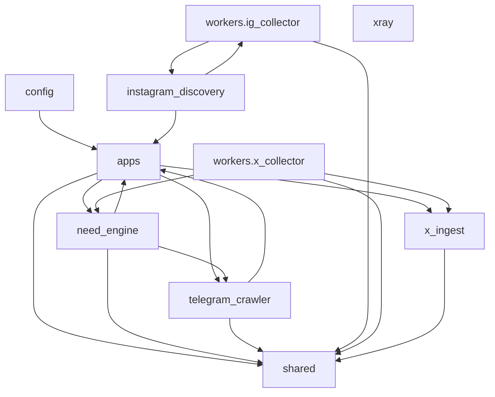

# Import dependency graph

Generated by `python scripts/import_graph.py`. Edges come from Python `import` and `from ... import` statements parsed with `ast`.

```mermaid
graph TD
    pkg_apps["apps"]
    pkg_need_engine["need_engine"]
    pkg_telegram_crawler["telegram_crawler"]
    pkg_workers_x_collector["workers.x_collector"]
    pkg_workers_ig_collector["workers.ig_collector"]
    pkg_x_ingest["x_ingest"]
    pkg_instagram_discovery["instagram_discovery"]
    pkg_shared["shared"]
    pkg_xray["xray"]
    pkg_config["config"]
    pkg_apps --> pkg_need_engine
    pkg_apps --> pkg_shared
    pkg_apps --> pkg_telegram_crawler
    pkg_apps --> pkg_x_ingest
    pkg_config --> pkg_apps
    pkg_instagram_discovery --> pkg_apps
    pkg_instagram_discovery --> pkg_workers_ig_collector
    pkg_need_engine --> pkg_apps
    pkg_need_engine --> pkg_shared
    pkg_need_engine --> pkg_telegram_crawler
    pkg_telegram_crawler --> pkg_apps
    pkg_telegram_crawler --> pkg_shared
    pkg_workers_ig_collector --> pkg_instagram_discovery
    pkg_workers_ig_collector --> pkg_shared
    pkg_workers_x_collector --> pkg_need_engine
    pkg_workers_x_collector --> pkg_shared
    pkg_workers_x_collector --> pkg_x_ingest
    pkg_x_ingest --> pkg_shared
```

Edges: 18.
